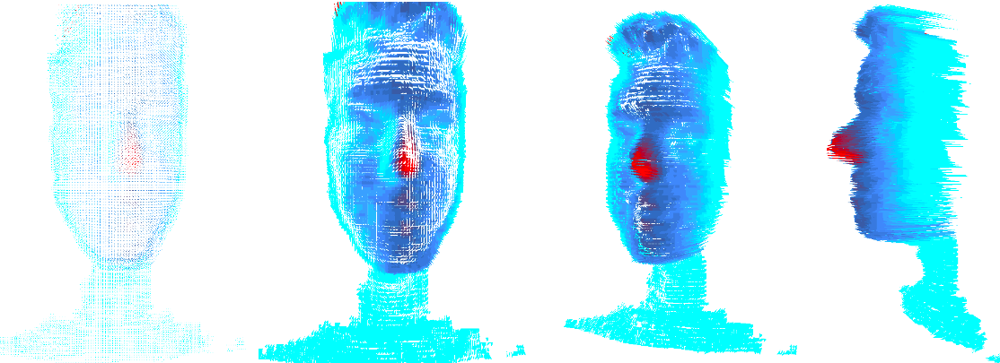

# rap3df-database

Esta é uma base de dados pública, com imagens faciais 3D, infraverlha e espectro de luz visível.

Sua utilização é permitido, apenas para fins acadêminos nas áreas de reconhecimento de padrões ou visão computacional, 
com o intúito de publicações de artigos ou trabalhos escolares.

### rap3df_data

Base de dados criada em 2017, com população de 64 voluntários, e um total de 267 amostras de imagens frontais e em poses aleatórias.




### rap3df_data_02

Base de dados iniciada em 2019 e em processo de coleta. 


### Build Linux

Este projeto utiliza as bibliotecas libfreenect2, OpenGL, Glut e Jsoncpp.
Para compilar o projeto, basta executar os seguintes comandos. 

```
cmake ./
make
```

### Run

```
./rap3df-viewer
```
